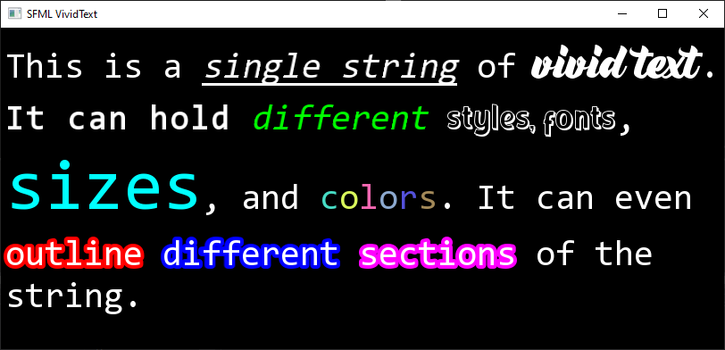

# Vivid Text

`VividText` is a class designed with [SFML-2.4.x](https://github.com/SFML/SFML/tree/2.4.x) in mind. It aims to provide a more modular & featureful text experience for SFML. This is done by allowing instances `VividText` to have different types of colors, fonts, sizes, etc, inside of a single string.

## Features
| Feature          | Supported          |
|:----------------:|:------------------:|
|Fill Color        | :white_check_mark: |
|Outline Color     | :white_check_mark: |
|Outline Thickness | :white_check_mark: |
|Font              | :white_check_mark: |
|Font Size         | :white_check_mark: |
|Text Style        | :white_check_mark: |
|Line Spacing      | :x:                |
|Letter Spacing    | :x:                |
|Highlighting      | :x:                |

The features that aren't supported will hopefully be implemented some time future.

## Example
```c++
#include <SFML/Graphics.hpp>
#include <iostream>
#include "VividText.h"

void loadFont(sf::Font& font, const std::string& location)
{
	if (!font.loadFromFile(location)) {
		std::cout << "Couldn't load " << location << std::endl;
		std::cin.get();
		std::exit(EXIT_FAILURE);
	}
}

int main()
{
	sf::RenderWindow window(sf::VideoMode(810, 360), "SFML VividText");
	srand(0xBADA55 - 0x420);

	sf::Font consola, shadow, running_nightshade;
	loadFont(consola, "consola.ttf");
	loadFont(shadow, "shadow.otf");
	loadFont(running_nightshade, "running_nightshade.ttf");

	sfv::VividText text("This is a single string of vivid text.\nIt can hold different styles, fonts,\nsizes, and colors. It can even\noutline different sections of the\nstring.", consola);
	text.setCharacterSize(40);
	text.setStyle(sf::Text::Style::Underlined | sf::Text::Style::Italic, 10, 13);
	text.setFont(running_nightshade, 27, 10);
	text.setCharacterSize(56, 27, 10);
	text.setStyle(sf::Text::Style::Bold, 39, 11);
	text.setFillColor(sf::Color::Green, 51, 9);
	text.setStyle(sf::Text::Style::Italic, 51, 9);
	text.setFont(shadow, 61, 13);
	text.setCharacterSize(80, 75, 6);
	text.setFillColor(sf::Color::Cyan, 75, 6);
	for (std::size_t i = 87; i != 93; ++i) {
		sf::Color color(rand() % 199 + 57, rand() % 199 + 57, rand() % 199 + 57);
		text.setFillColor(color, i, 1);
	}
	text.setOutlineColor(sf::Color::Red, 107, 8);
	text.setOutlineColor(sf::Color::Blue, 115, 9);
	text.setOutlineColor(sf::Color::Magenta, 125, 8);
	text.setOutlineThickness(4.f, 107, 26);

	while (window.isOpen())
	{
		sf::Event event;
		while (window.pollEvent(event))
		{
			if (event.type == sf::Event::Closed)
				window.close();
		}

		window.clear();
		window.draw(text);
		window.display();
	}

	return 0;
}
```
### Output


## Credit
This project is dependent on [SFML-2.4.x](https://github.com/SFML/SFML/tree/2.4.x). More notably, this project has taken few snippets from the original [Text.cpp](https://github.com/SFML/SFML/blob/2.4.x/src/SFML/Graphics/Text.cpp) file and modified them to work with the `VividText` class.
